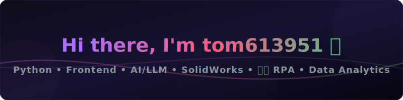
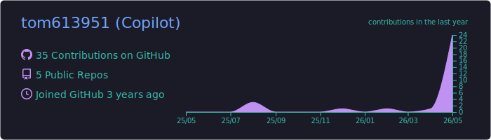
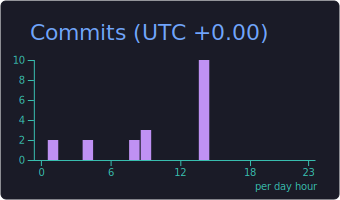
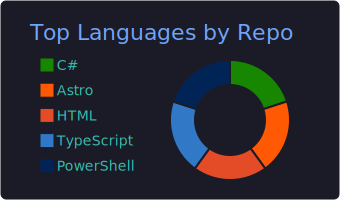
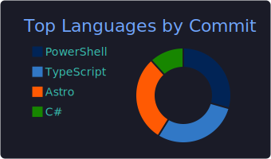

<!-- Custom SVG Header Banner (Local Asset) -->
<p align="center">
  
</p>

<!-- Dynamic Typing SVG Banner -->
<p align="center">
  <a href="https://git.io/typing-svg">
    
  </a>
</p>

---

## ⚡ About Me

```yaml
- 🎓 Identity: Student Explorer & Tech Enthusiast
- 💻 Focus: Python Backend, Web Frontends, and AI Model Integration
- ⚙️ Design: SolidWorks Mechanical Design & 影刀 RPA (Robotic Process Automation)
- 📊 Data: Relational Databases, Advanced Excel & Power BI Analytics
- 🚀 Mission: Building intelligent, visually-stunning systems bridging hardware, code, and data
```

---

## 🛠️ My Tech Stack

### 🧠 Artificial Intelligence, LLMs & Deep Learning
<p align="left">
  
  
  
  
  
  
</p>

### 💻 Frontend Development & Data Visualization
<p align="left">
  
  
  
  
  
  
  
</p>

### ⚙️ Engineering, RPA & 3D Modeling
<p align="left">
  
  
  
</p>

### 📊 Data Analysis, SQL & Backend
<p align="left">
  
  
  
  
  
  
  
</p>

### 🛠️ Tools & Environments
<p align="left">
  
  
  
  
</p>

---

## 🎯 Learning & Development Goals
Here is a quick overview of what I am currently focusing on:

- **🤖 LLM Applications & Fine-Tuning (Meta Llama 3)**
  `████████░░ 80%`
- **📈 Advanced Front-End & Data Visualization (Vue/React + ECharts)**
  `███████░░░ 70%`
- **⚙️ Robotic Process Automation (RPA) & Workflow Design (影刀 RPA)**
  `██████░░░░ 60%`
- **📊 Business Intelligence & Big Data Analysis (Power BI + SQL)**
  `████████░░ 80%`

---

## 📊 My GitHub Dashboard

<!-- Locally Generated Stats Cards (Generated via GitHub Action daily) -->
<div align="center">
  <table border="0" style="border-collapse: collapse; border: none; margin: auto;">
    <tr style="border: none;">
      <td style="border: none; padding: 5px;">
        
      </td>
      <td style="border: none; padding: 5px;">
        
      </td>
    </tr>
    <tr style="border: none;">
      <td style="border: none; padding: 5px;">
        
      </td>
      <td style="border: none; padding: 5px;">
        
      </td>
    </tr>
  </table>
</div>

---

## 🐍 Contribution Snake Game
<p align="center">
  
</p>

---

<!-- Visitor Counter -->
<p align="right">
  
</p>
